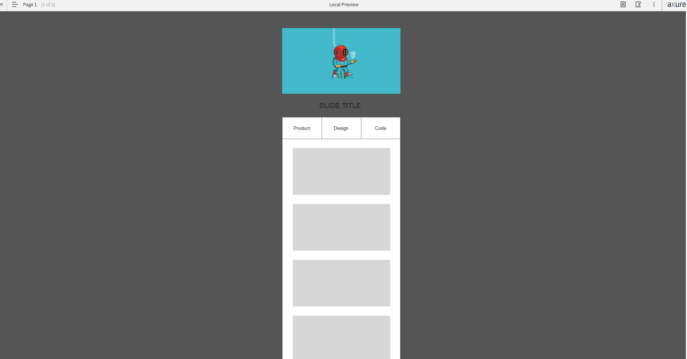
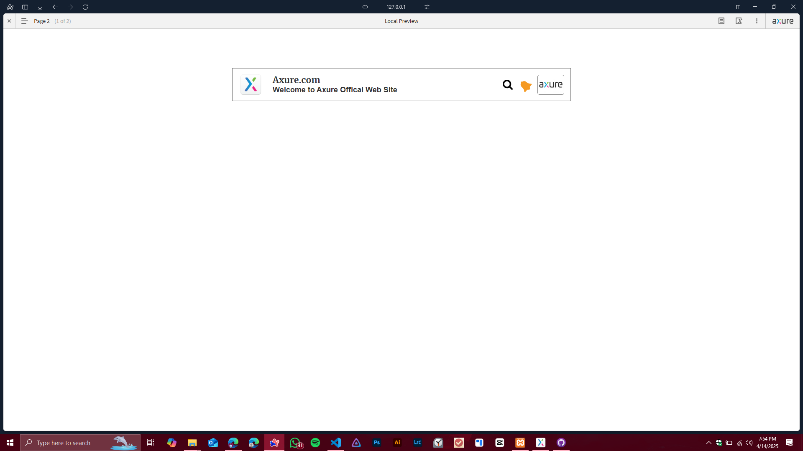

# Dynamic Panels & Animations Practical - Day 05 🎬

This repository documents the **Day 05** practical session for **IT3213 Human Computer Interaction (HCI)**, focusing on **dynamic panels**, **scroll-triggered animations**, and **icon animations** in **Axure RP 9**.

---

## Practical Overview 🚀
The goal of this session is to implement a **fixed navigation bar** and **animated UI elements** across two pages. 

---

## Day 05 Progress - Fixed Navbar & Bell Icon Animation 🛎️

### Page 01: Fixed Navigation Bar with Dynamic Panel 🔝
1. **Dynamic Panel Setup**:
   - Grouped navbar icons (Home, Programs, Classes, Videos) into a dynamic panel.
   - **Pinned to Browser**: Positioned at the **top center** of the screen.
2. **Scroll Interaction**:
   - Show/hide the navbar dynamically based on scroll position (`Window.scrollY`).

#### Screenshot of Page 01:

---

### Page 02: Animated Navigation Bar with Bell Icon 🔔
1. **UI Elements**:
   - **Search button**
   - **Axure logo**
   - **Bell icon** with animation.
2. **Bell Icon Animation**:
   - **Interaction**: When the page loads:
     1. Rotate the bell icon **60 degrees counterclockwise** (linear animation, 100ms duration).
     2. Wait **100ms**.
     3. Rotate the bell icon back **60 degrees clockwise** (linear animation, 100ms duration).
     4. **Fire the "Loaded" event** again to loop the animation indefinitely.

#### Screenshot of Page 02:

---

### Interaction Logic for Bell Icon 🔄
1. On Page Load:
   - Rotate Bell by -60° (linear 100ms)
   → Wait 100ms
   → Rotate Bell by +60° (linear 100ms)
   → Trigger "Loaded" event to repeat the animation.

---

## How to Use the Axure RP 9 File 📂
1. Download and install **Axure RP 9** if you haven't already.
2. Open the `.rp` file provided in this repository.
3. Navigate through the pages using the **Page Navigator** in Axure RP 9.
4. Preview the prototype by clicking the **Preview** button to see the interactions in action.

---

---

## Hosted Project on Axure Cloud ☁️
The project will be hosted on **Axure Cloud** for easy access and interaction. You can view the live prototype by clicking the link below:

🔗 **[Axure Cloud Project Link](https://4jwxag.axshare.com)**  

---

## License 📜
This project is licensed under the MIT License. See the [LICENSE](LICENSE) file for details.